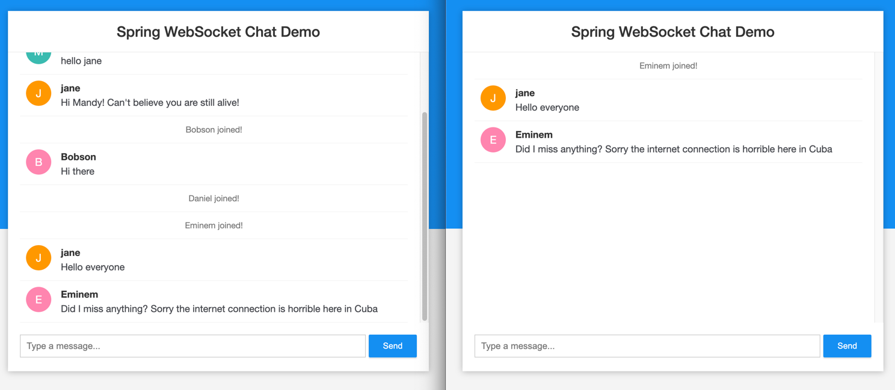
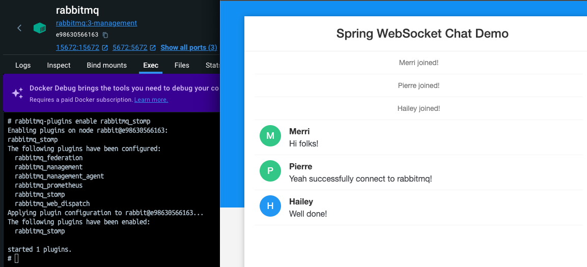

# Websocket practice 

1. Initialize a new project
   使用 spring-cli 詠唱咒語
   ```bash
   $ spring init --name=websocket-practice -dependencies=websocket websocket-practice
   Using service at https://start.spring.io
   Project extracted to '/<path-to-your-dir>/websocket-practice'
   ```

2. 新增一個 `config` package 底下的 `WebSocketConfig.java`
   - `@EnableWebSocketMessageBroker`: 掛在類別上，用來啟用 WebSocker Server
   - 實作 `WebSockerMessageBrokerConfigurer` 介面：
     - `registerStompEntpoints(registry)`: 註冊一個 websocket endpoint
       - 目的：client 會用這個 endpoint 與 websocket server 建立連線
       - `withSockJS()` 用來啟用 fallback options 給不支援 websocket 的 browser
       - `STOMP`: 全名 simple text oriented messaging protocol，定義資料交換的格式與規則
     - `configureMessageBroker(registry)`: 用來 route 訊息從 clientA 到 clientB
       - message destination 以 `/topic` 作前綴字的，要路由到 message broker，這個 message broker 會把訊息廣播到所有訂閱特定主題的 clients
       - message destination 開頭是 `/app` 前綴的，應該要路由到 messaging-handling 方法（後續定義）
     - 以上範例使用 in-memory message broker，也可以改成其他功能更完整的 message broker，例如 RabbitMQ 或者 ActiveMQ

3. 新增 ChatMessage model, ChatController 以及 WebSocketEventListener
4. 加入前端 HTML, CSS, JavaScript
   - 使用函式庫：`sockjs`, `stomp` JavaScript libraries
   - `SockJS`: WebSocket client，使用原生 WebSockets，對於比較有年代的/不支援 WebSocket 的瀏覽器有提供 fallback options 
   - `STOMP JS`: JavaScript 的 stomp client
5. Demo
   

6. 使用 RabbitMQ 作為 message broker
    - 加入以下兩個 dependencies :
        - spring-boot-starter-amqp
        - spring-boot-starter-reactor-netty (for Full Featured STOMP Broker Relay)
    - Docker container for RabbitMQ
      ```bash
      docker run -d --name rabbitmq -p 5672:5672 -p 15672:15672 -p 61613:61613 rabbitmq:3-management
      ```
    - Modify WebSocketConfig, enableSimpleBroker -> enableStompBrokerRelay
    - Test your code
    - 遇到以下的錯誤訊息，參考 [Stomp-plugin](https://www.rabbitmq.com/docs/stomp) 這個連結啟用 stomp plugin
      ```dockerfile
      TCP connection failure in session _system_: Transport failure: Connection reset
          at java.base/sun.nio.ch.SocketChannelImpl.throwConnectionReset(SocketChannelImpl.java:401) ~[na:na]
          at java.base/sun.nio.ch.SocketChannelImpl.read(SocketChannelImpl.java:434) ~[na:na]
          at io.netty.buffer.PooledByteBuf.setBytes(PooledByteBuf.java:255) ~[netty-buffer-4.1.111.Final.jar:4.1.111.Final] ...
      ``` 
    - 這樣就成功連上 rabbitMQ broker 了
      
      
      
## 改造成分布式集群

1. 加入 Redis dependencies 以及 redis appplication config